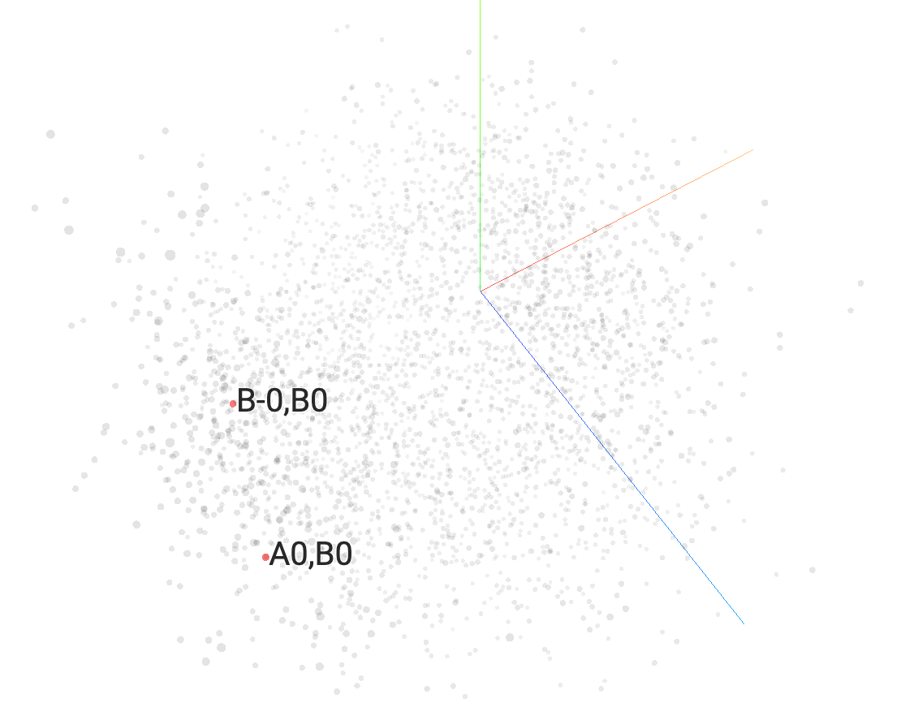
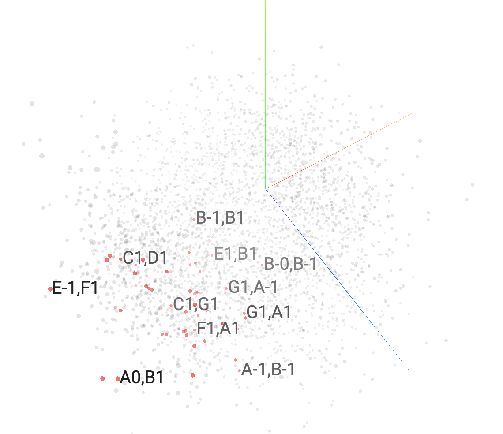
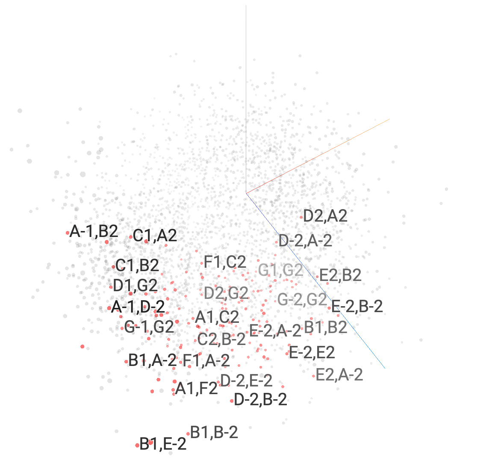
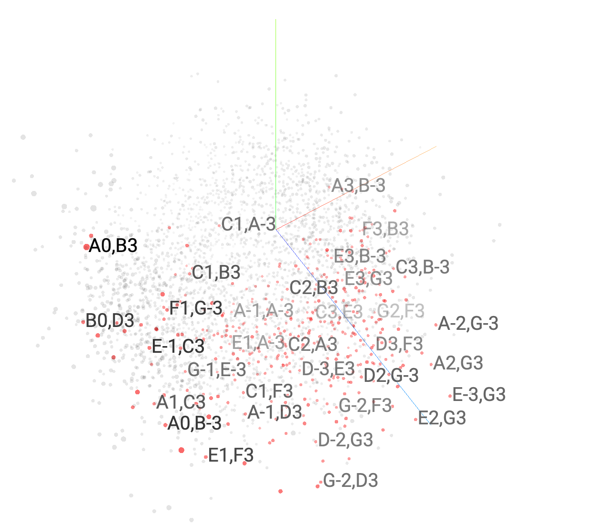
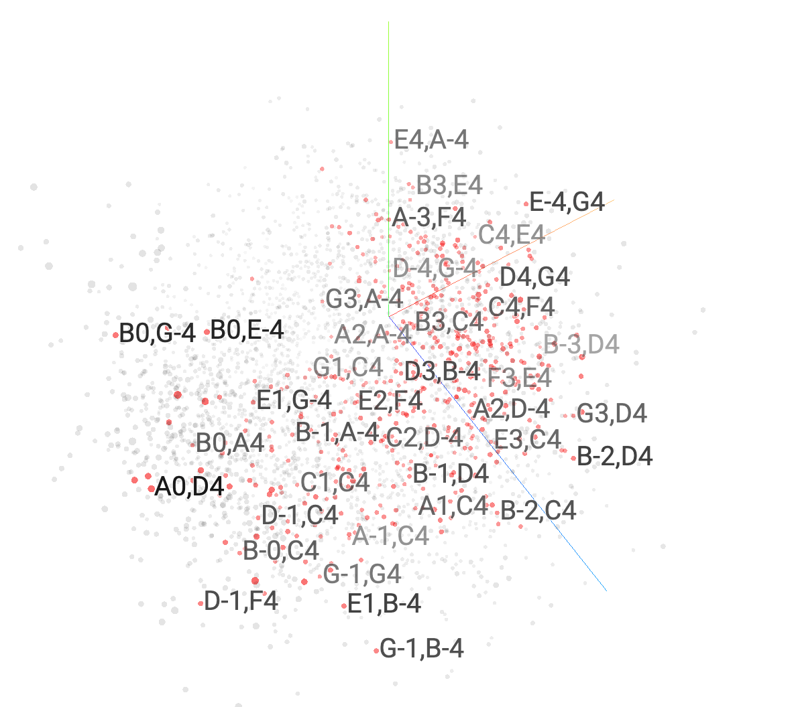
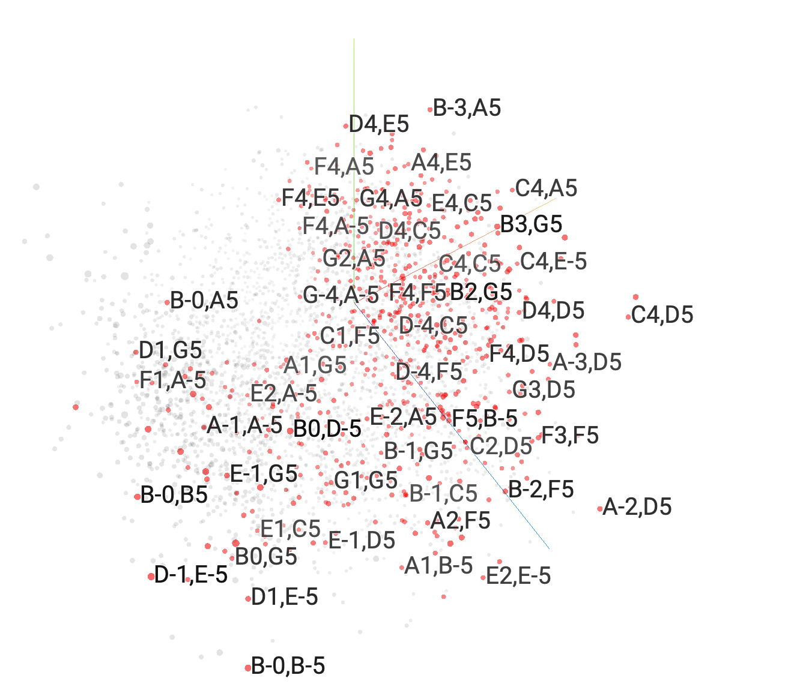
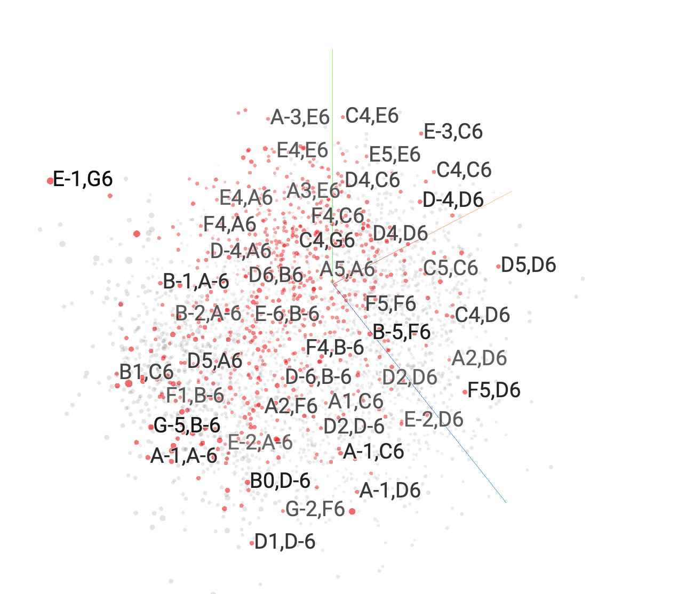
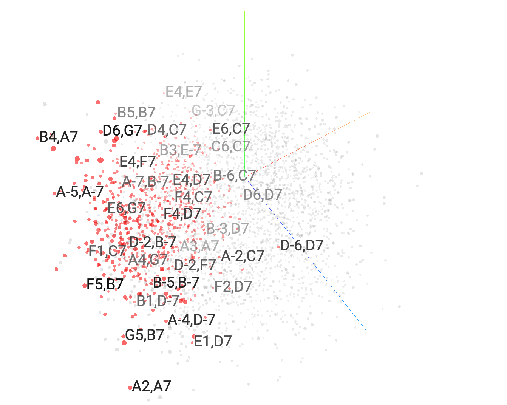
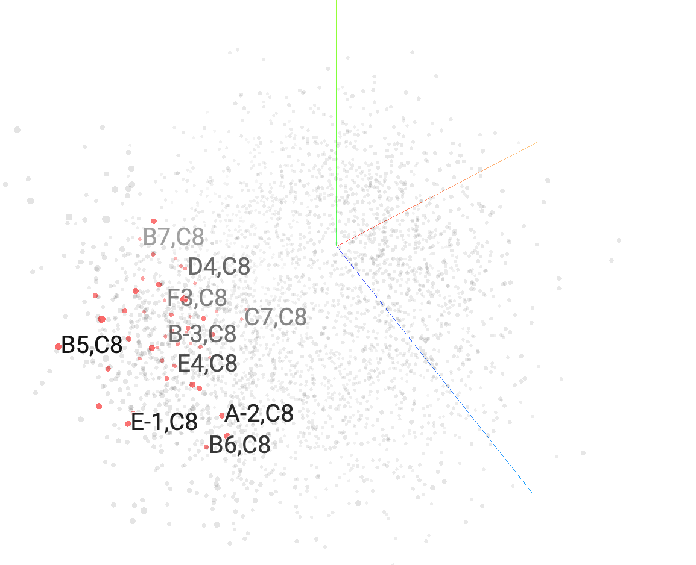

# CS181AD Final Project

**Project description:** Explore the ways in which traditional NLP techniques can be applied to the "language" of jazz music, particularly jazz piano.

## Datasets
- [Granroth Wilding Jazz Chord Corpus](http://jazzparser.granroth-wilding.co.uk/attachments/JazzCorpus/chord_corpus.txt)
  - Annotations of the chord progressions to jazz standards (e.g. `Cm Fm7 G7`)
- [Doug McKenzie Jazz Piano MIDI Dataset](https://bushgrafts.com/midi/)
  - MIDI transcriptions of about 300 jazz tunes

## Music Theory Background
Most music can be broken down into two components; melody and harmony. The melody is often the highest and most noticeable part in the music, and is typically what you would sing if someone asked you to remind them of a song. The harmony can be usually thought of as a series of chords that set the "foundation" for the melody and the song as a whole. Guitarists and pianists will often play the chords to a song (the harmony) while singing the melody.

There is a special notation for chords that describe in a few symbols what the "main idea" behind the chord is. For example, the chord symbol `Cm7` means "C minor seventh chord", which can be translated into the notes `C Eb G Bb`. So, chords progressions are basically a shorthand for how to play the tune. The Wilding dataset contains data in this form.

In jazz, chord progressions are very much loose guidelines for how to play the tune, and experienced pianists often voice the chords ("voice" = choose which specific notes to play) so creatively that chord notation fails to capture the complexity. For example, even the tune might call for a `C7` chord, which technically means the notes `C E G Bb`, a pianist might voice it as `Bb D E G` or even `Bb Eb E Ab`, depending on the context. A pianist may even choose a completely different chord that serves the same function. For this reason, I also explored using the Doug McKenzie MIDI database, since it contains the exact notes that a jazz pianist might play as opposed to vague symbols.

## Exploration 1. Word2Vec For Chord Symbols

Notebooks `01-clean-wilding-dataset.ipynb` and `02-wilding-word2vec.ipynb` deal with cleaning the chord dataset and training a skip-gram Word2Vec model on the chord progressions. The hope was that, after training, chords with the most similar function (appear in similar contexts) have similar vectors and therefore the highest cosine similarity. However, this wasn't observed as strongly as I would have hoped. Some experimental results are included at the bottom of `02-wilding-word2vec.ipynb`, but it's not immediately discernible whether the Word2Vec model has learned the function of chords from context. This could very well be due to the small data size. The chord embeddings can be projected onto 3 dimensions, which result in the following vector distribution:

Despite the clear clustering, no obvious pattern was found for which chords end up in which cluster.

## Exploration 2. LSTM For Chord Symbols

Notebook `03-wilding-lstm.ipynb` deals with training a stacked LSTM on the Wilding dataset using the embeddings learned by the Word2Vec model. The results, at least experimentally, seem to indicate the the chord embeddings did in fact retain at least some information about the function of chords in a progression. The example included at the bottom of the notebook is also illustrated on the piano [in this video](https://youtube.com/shorts/5NdRp_nxlac?feature=share).

## Exploration 3. GPT2 On Chord Pairs
When considering how to train a language model on MIDI data, two conflicting issues presented themselves. If each chord is considered an atomic token (e.g. `C4 E4 G4` as a single token), then the vocabulary size is astronomical. This doesn't seem right, since chords are made up of notes, and pianists choose notes for how they sound together. However, if we split up every chord into its individual notes, even though the vocabulary size now drops to 88, now each token carries virtually no meaning since a `C` in one chord could have a very different effect in another chord. In an attempt to find a middle ground, I considered every *pair* of notes in a chord and constructed a chord token from those pairs.

For example, the chord `Eb G Bb D`, would be represented as `<chord> Eb,G Eb,Bb Eb,D G,Bb G,D Bb,D </chord>`. This keeps the vocabulary relatively small at a maximum of `88 nCr 2 = 3828` while learning representations for intervals of notes, which carry more meaning than the notes themselves.

Empirically, the results sounded more or less reasonable on the piano, but I found that many generated timesteps were useless because in the original dataset, the pianist's fingers may not all release at the same time, resulting in timesteps where notes are simply dropping out, one by one. As a result, the model learned a similar pattern, which is besides the point, since the model should ideally be learning the transition from one chord to the next, not from a chord to each individual finger releasing. This inspired the changes which resulted in the final model.

Despite the large vocabulary size (compared to the chord symbol dataset), the embeddings could still be projected into 3D space. Interestingly, it appears that intervals were largely clumped by their register (lower registers mean lower notes on the piano). The following images illustrate queries on the embedding space by register.

