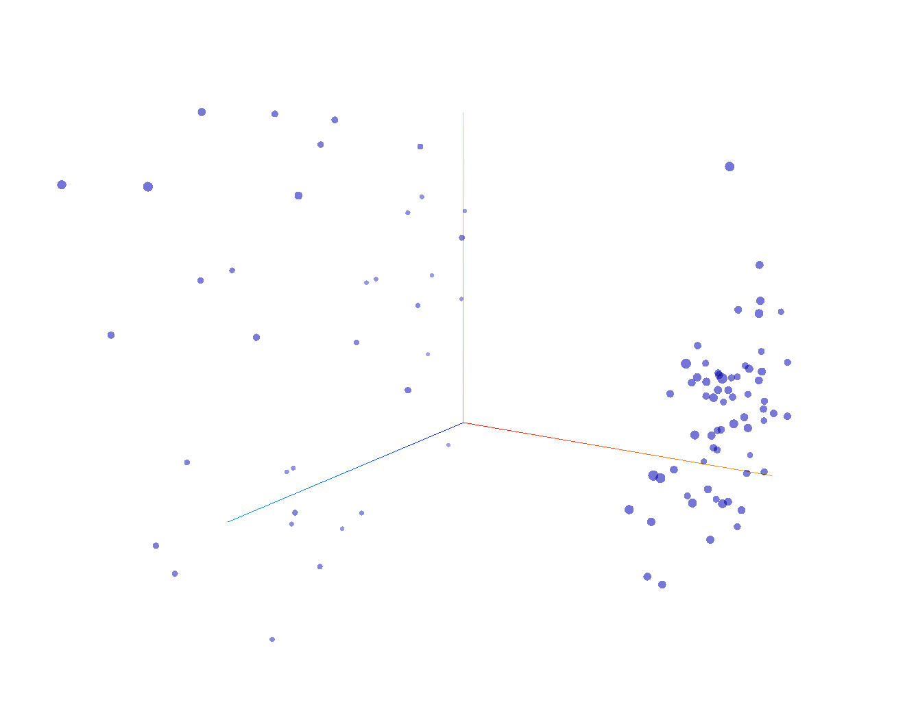
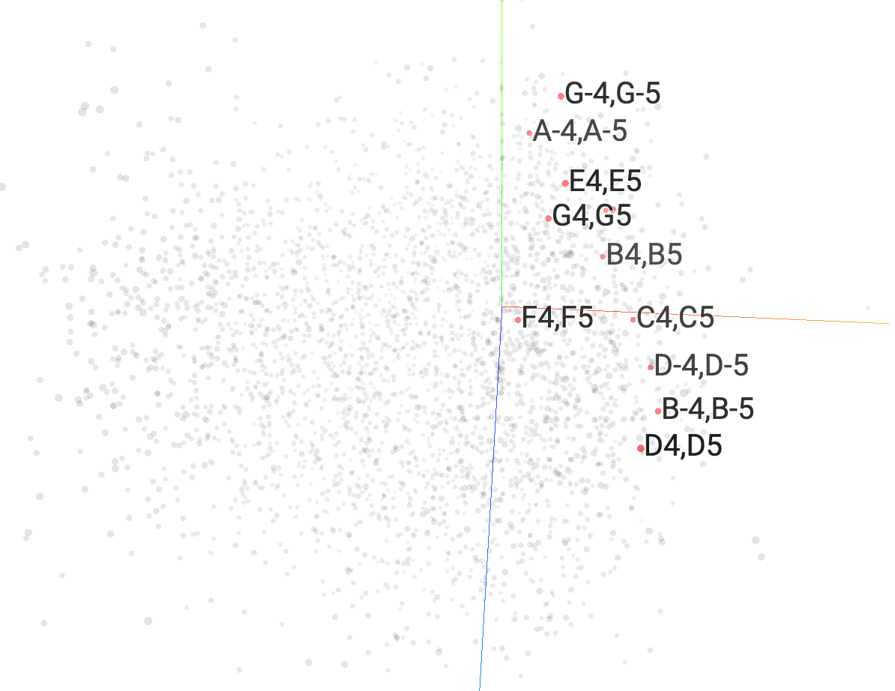

# CS181AD Final Project

**Project description:** Explore the ways in which traditional NLP techniques can be applied to the "language" of jazz music, particularly jazz piano.

## Datasets
- [Granroth Wilding Jazz Chord Corpus](http://jazzparser.granroth-wilding.co.uk/attachments/JazzCorpus/chord_corpus.txt)
  - Annotations of the chord progressions to jazz standards (e.g. `Cm Fm7 G7`)
- [Doug McKenzie Jazz Piano MIDI Dataset](https://bushgrafts.com/midi/)
  - MIDI transcriptions of about 300 jazz tunes

## Saved data (for skipping processing steps)
- `wilding-corpus.txt` can be downloaded directly from the first link above
- `piano-midi/` (MIDI files containing only piano parts) can be downloaded [here](https://drive.google.com/drive/folders/1pMBvfYFsDrTZYb45VK8-DM10kmqfChtd?usp=sharing)
- `corpus-pairs-txt/` can be dowloaded [here](https://drive.google.com/drive/folders/1rsGXqeGndFdUKdxxRC-BJRL3yg6n7Y0f?usp=sharing) for notebooks 9 and 10
- `chords-txt-augmented/` can be downloaded [here](https://drive.google.com/drive/folders/1JFZck4t0GE_dv5T6Akpj3eQEGBf59w56?usp=sharing) for notebooks 11 and 12

## Music Theory Background
Most music can be broken down into two components; melody and harmony. The melody is often the highest and most noticeable part in the music, and is typically what you would sing if someone asked you to remind them of a song. The harmony can be usually thought of as a series of chords that set the "foundation" for the melody and the song as a whole. Guitarists and pianists will often play the chords to a song (the harmony) while singing the melody.

There is a special notation for chords that describe in a few symbols what the "main idea" behind the chord is. For example, the chord symbol `Cm7` means "C minor seventh chord", which can be translated into the notes `C Eb G Bb`. So, chords progressions are basically a shorthand for how to play the tune. The Wilding dataset contains data in this form.

In jazz, chord progressions are very much loose guidelines for how to play the tune, and experienced pianists often voice the chords ("voice" = choose which specific notes to play) so creatively that chord notation fails to capture the complexity. For example, even the tune might call for a `C7` chord, which technically means the notes `C E G Bb`, a pianist might voice it as `Bb D E G` or even `Bb Eb E Ab`, depending on the context. A pianist may even choose a completely different chord that serves the same function. For this reason, I also explored using the Doug McKenzie MIDI database, since it contains the exact notes that a jazz pianist might play as opposed to vague symbols.

## Exploration 1. Word2Vec For Chord Symbols

Notebooks `01-clean-wilding-dataset.ipynb` and `02-wilding-word2vec.ipynb` deal with cleaning the chord dataset and training a skip-gram Word2Vec model on the chord progressions. The hope was that, after training, chords with the most similar function (appear in similar contexts) have similar vectors and therefore the highest cosine similarity. However, this wasn't observed as strongly as I would have hoped. Some experimental results are included at the bottom of `02-wilding-word2vec.ipynb`, but it's not immediately discernible whether the Word2Vec model has learned the function of chords from context. This could very well be due to the small data size. The chord embeddings can be projected onto 3 dimensions, which result in the following vector distribution:

Despite the clear clustering, no obvious pattern was found for which chords end up in which cluster.

## Exploration 2. LSTM For Chord Symbols

Notebook `03-wilding-lstm.ipynb` deals with training a stacked LSTM on the Wilding dataset using the embeddings learned by the Word2Vec model. The results, at least experimentally, seem to indicate the the chord embeddings did in fact retain at least some information about the function of chords in a progression. The example included at the bottom of the notebook is also illustrated on the piano [in this video](https://youtube.com/shorts/5NdRp_nxlac?feature=share).

## Exploration 3. GPT2 On Chord Pairs
When considering how to train a language model on MIDI data, two conflicting issues presented themselves. If each chord is considered an atomic token (e.g. `C4 E4 G4` as a single token), then the vocabulary size is astronomical. This doesn't seem right, since chords are made up of notes, and pianists choose notes for how they sound together. However, if we split up every chord into its individual notes, even though the vocabulary size now drops to 88, now each token carries virtually no meaning since a `C` in one chord could have a very different effect in another chord. In an attempt to find a middle ground, I considered every *pair* of notes in a chord and constructed a chord token from those pairs.

For example, the chord `Eb G Bb D`, would be represented as `<chord> Eb,G Eb,Bb Eb,D G,Bb G,D Bb,D </chord>`. This keeps the vocabulary relatively small at a maximum of `88 nCr 2 = 3828` while learning representations for intervals of notes, which carry more meaning than the notes themselves.

Empirically, the results sounded more or less reasonable on the piano, but I found that many generated timesteps were useless because in the original dataset, the pianist's fingers may not all release at the same time, resulting in timesteps where notes are simply dropping out, one by one. As a result, the model learned a similar pattern, which is besides the point, since the model should ideally be learning the transition from one chord to the next, not from a chord to each individual finger releasing. This inspired the changes which resulted in the final model.

Despite the large vocabulary size (compared to the chord symbol dataset), the embeddings could still be projected into 3D space. Interestingly, it appears that intervals were largely clumped by their register (lower registers mean lower notes on the piano). Images illustrate queries on the embedding space by register can be found in `images/` as `octave-0.png`, `octave-1.png`, and so on.

Also, some intervals grouped in the same embedding space. For examples, octaves (e.g. C4 to C5) are clumped together in one corner of the space.

## Exploration 4. GPT On Cleaned MIDI Chords

To improve upon some of the shortcomings of the previous encoding, I devised a method to address some of these.

**Issue 1:** Vocabulary size is too large if chords aren't broken up into notes.  
**Solution:** Extract only the middle 3 octaves of the piano, from C3 to C6; most chords appear in this range anyway. Additionally, we can choose a vocabulary size (e.g. 8000) and algorithmically replace less frequent chords with simpler, more common versions of the same chord. With these two additions, it's possible to represent a chord as a single token without blowing up the vocabulary size.

**Issue 2:** The model is learning to predict individual notes in a chord being released.  
**Solution:** Implement an algorithm for determining if two timesteps are "different enough" to include or discard. This involves testing if one chord is a subset or superset of the other, ensuring that at least 3 new notes are added that weren't in the previous timestep, and that there are at least 3 notes in the chord. This helps clean the dataset to be strictly a sequence of distinct chords.

**Issue 3:** The dataset is still too small.  
**Solution:** Each tune can be transposed into 11 other keys. Transposing to another key does not affect the function of any of the chords, it's just that every note is shifted up / down by the same amount. This increases the size of our data by 12 times.

The model actually generated pleasing results. For example, the following two examples are chord progressions generated by the model from the seed of a single chord: [video 1](https://youtube.com/shorts/Yyd9nEhZl0U?feature=share), [video 2](https://youtube.com/shorts/ATmzpT0rWoI?feature=share).

## Conclusion

The best results so far (at least aurally) were produced by limiting the range of notes considered, augmenting the data by transposing, and applying algorithms to reduce unnecessary noise in raw MIDI jazz piano. This implies that jazz piano harmony can certainly be learned (or rather, mimicked) by a sufficiently complex language model.

However, it's not clear whether the chord embeddings actually demonstrate an understanding of how chords function in the context of jazz. For example, while a model could generate the circle of fifths (see LSTM example), the embeddings themselves did not reconstruct the circle of fifths, nor did similar chords appear to be clustered. This may have to do, again, with the size of the data, or the method used to deconstruct chords into more atomic pieces.

In the future, I'd like to explore more clever ways of deconstructing chords into smaller elements in a way more analagous to how a human might think about it. For example, two chords that differ only in key should be semantically related, and so on. I would also like to re-attempt training a VAE, since the idea of varying the latent vector and getting slightly different interpretations of the same music sounds very exciting, but would require a very clever design. I attempted implementing a recurrent VAE, but it did not perform well, likely because of how I designed it. The notebook is included in the GitHub but not documented like the others.